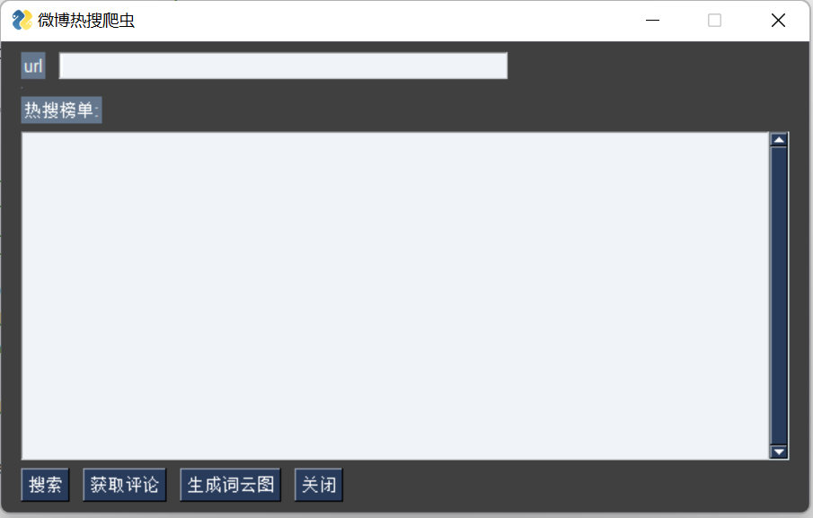

# weibo_crawler
A python homework about crawler in BUPT
北邮网安院 2023春 python 

## 使用指南 
本程序 用于对微博热搜 及其 热评内容的爬取  
运行 `python3 main.py` 即可 生成 可视化UI 进行操作

### 搜索 ：
爬去并且展示 微博热搜 
### 获取评论：
请在 url 框里填入热搜关键词的url, 例如 "https://s.weibo.com/weibo?q=%23男双%23" 
### 生成词云图：
对选定 热搜的评论内容进行爬取，并且展示，注意，获取评论后 才能 生成词云图  

在使用此程序前，请确保 mysql已经在本地运行，账号：root， 密码：root，端口默认：3306

并且创建一个数据库`CREATE DATABASE weibo CHARACTER SET utf8mb4 COLLATE utf8mb4_unicode_ci` 

## 需求分析

### 基础功能

- 爬取网站信息：针对微博新闻，实现对该网站上的热点信息的爬取。 
- 多层次爬取：实现两个层次的爬取，对于某个热点页面，不仅爬**热点的内容**和**热评**，还可以针对发表热评的用户，爬取用户的id、性别、粉丝数量、关注别人的数量。 
- 内容展示和保存：对爬取的内容进行展示，展示前50条**热点信息**，并且针对选取特定的热点信息，爬取其**热评内容*和发表**用户的相关信息**，将爬取到的信息在自己设计的 UI页面上展示，并且保存在数据库中。

### 拓展功能

- 数据库管理：通过使用pymysql库连接Mysql**数据库**，将爬取的信息存储到数据库中进行管理。
- 分离设计：将爬取功能与数据展示进行分离设计，实现定时检查网站内容是否更新并及时爬取入库，同时数据展示模块对库内数据进行展示。
- 文本分析功能：实现对爬取的文本进行分析展示，对热评内容进行**高频词**分析。
- 图形界面：使用**PythonSimpleGUI**库开发图形界面，提供用户友好的操作界面。
- 词云模块：对高频词 进行词云统计，并且生成**词云图**。

## 模块设计

### 网站爬取模块：  

- 负责针对微博新闻网站进行信息爬取。 
- 使用爬虫框架（如Scrapy）来实现网页解析和内容提取。 
- 实现爬取热点信息以及对应的热评信息。 

### 多层次爬取模块：  

- 实现两个层次的爬取，针对热点信息页面和热评信息页面进行爬取。 
- 对热评信息页面，爬取热评内容以及发表该热评的用户信息（如用户ID、性别、粉丝数量、关注数量）。 
- 可以使用递归或迭代方式实现多层次爬取。 

### 内容展示和保存模块：  

- 对爬取到的热点信息进行展示，展示前50条热点信息。 
- 对选定的特定热点信息，爬取对应的热评内容和发表用户的相关信息。
-  将爬取到的信息保存到数据库中，使用pymysql库连接Mysql数据库进行数据管理。 

### 数据库管理模块： 

- 使用pymysql库连接Mysql数据库，实现爬取信息的存储和管理。
-  可以设计数据库表来存储热点信息、热评信息和用户信息，并提供插入、更新和查询等功能。 

### 分离设计模块：  

- 实现定时检查网站内容是否更新，并及时爬取最新内容入库。 数据展示模块从数据库中获取数据，并进行展示。

### 文本分析模块：  

- 对爬取的热评内容进行高频词分析，统计词频。 
- 可以使用Python的文本处理库（jieba）来进行文本分析和词频统计。

### 图形界面模块： 

- 使用PythonSimpleGUI库来开发图形界面，提供用户友好的操作界面。 实现展示爬取信息、查询功能、显示分析结果等功能。 

## 数据库设计

一共分为 两个表单

### 微博热搜前 50

`date`：日期，存储热搜信息的日期，数据类型为DATE。 
`time`：时间，存储热搜信息的时间，数据类型为TIME。 
`hot_index`：热度指数，热搜的热度指数，数据类型为INT。 
`name`：热搜名称，热搜的具体名称，数据类型为VARCHAR(255)。 
`raw_hot`：原始热度，热搜的原始热度值，数据类型为INT。 
`label_name`：标签名称，热搜的标签名称，数据类型为VARCHAR(255)。 
`url`：链接地址，热搜的相关链接地址，数据类型为VARCHAR(255)。

### 评论搜集

`new_id`：新闻ID，评论所属的新闻的ID，数据类型为VARCHAR(20)。 `author_name`：作者名称，评论的作者名称，数据类型为VARCHAR(50)。
`fans`：粉丝数量，评论作者的粉丝数量，数据类型为VARCHAR(20)。 
`comment_id`：评论ID，评论的唯一标识，数据类型为VARCHAR(20)。 `comment_text`：评论内容，评论的文本内容，数据类型为TEXT。 
`user_name`：用户名称，评论的用户名称，数据类型为VARCHAR(50)。
`user_id`：用户ID，评论的用户ID，数据类型为VARCHAR(20)。 `user_follow_count`：用户关注数量，评论的用户关注数量，数据类型为VARCHAR(20)。
`user_followers_count`：用户粉丝数量，评论的用户粉丝数量，数据类型为VARCHAR(20)。 
`user_gender`：用户性别，评论的用户性别，数据类型为VARCHAR(5)
